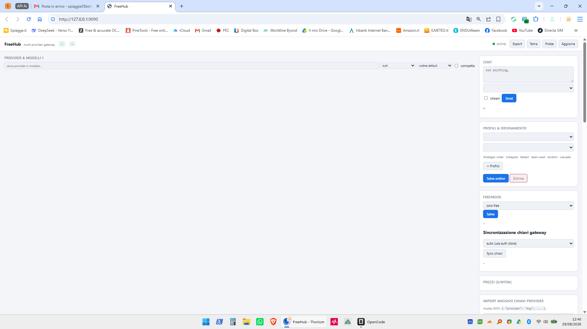

# LLM Aggregator

Un gateway locale **OpenAI-compatible** che unifica decine di provider LLM dietro un'unica API, con autorouting, failover, retry intelligente, cache e una control panel. Zero dipendenze npm.

---

## Quick start

```bash
npm install
npm run server
# apre http://127.0.0.1:9090/
```

---

## Architettura

```
┌─────────────────────────────────────────────────────────┐
│                    Control Panel                         │
│  (http://127.0.0.1:9090/ — HTML/CSS/JS, no framework)  │
└────────────────┬────────────────────────────────────────┘
                 │ HTTP
┌────────────────▼────────────────────────────────────────┐
│                  Gateway Node.js                          │
│  /v1/chat/completions  /v1/embeddings  /v1/models       │
│  /hub/*  /metrics  /v1/health                            │
├──────────────────────────────────────────────────────────┤
│  Routing  │  Cache  │  Auth  │  Circuit Breaker        │
│  Pricing  │  Health │  Retry │  SSRF Guard             │
└─────┬──────────────┬───────────────┬────────────────────┘
      │              │               │
      ▼              ▼               ▼
  Pollinations   Groq/OpenAI    OpenRouter/HF
  GLHF/llm7.io   Together       HuggingFace
```

---

## Funzionalità

### API compatibile OpenAI
```
POST http://127.0.0.1:9090/v1/chat/completions
Authorization: Bearer <gateway-key>
{
  "model": "auto",          ← "auto" = autorouting
  "messages": [{"role":"user","content":"..."}],
  "stream": false
}
```

### Autorouting
Sceglie il modello migliore in base al profilo e al contenuto del prompt:

| Profilo | Trigger | Provider tipico |
|---------|---------|-----------------|
| `auto-code` | keyword code / function / debug | Groq, Pollinations |
| `auto-reasoning` | step by step / why / explain | Pollinations, OpenRouter |
| `auto-fast` | default, prompt breve | Pollinations |
| `auto` | fallback universale | round-robin sui modelli attivi |

Usa `cascade: ["model-id-1", "model-id-2"]` per failover automatico su più modelli.

### Circuit Breaker
- Ogni provider ha un circuit breaker indipendente.
- Dopo 3 fallimenti consecutivi il provider viene escluso temporaneamente (backoff esponenziale).
- Stato persistente in `health-state.json`: sopravvive ai riavvii.

### Retry con backoff
- Retry automatico con full-jitter esponenziale (`base: 300ms, cap: 5000ms`).
- Numero di tentativi configurabile via `prefs.settings.retryAttempts` (default 2).

### Cache
- SHA-256 keyed cache per risposte identiche.
- TTL configurabile (default 10 minuti).
- Disabilitabile con `AGG_CACHE=0`.

### Metriche
```
GET /metrics          ← Prometheus text format
GET /v1/health       ← JSON { ok, models }
```

---

## API di controllo (`/hub/*`)

Protette da token (via `Authorization: Bearer <token>` o query `?token=…`).

| Endpoint | Metodo | Descrizione |
|----------|--------|------------|
| `/hub/state` | GET | Stato gateway, modelli, provider |
| `/hub/settings` | GET/POST | Impostazioni (verifyMs, failoverMs, retryAttempts…) |
| `/hub/provider/add` | POST | Aggiunge provider (validazione SSRF) |
| `/hub/provider/remove` | POST | Rimuove provider |
| `/hub/provider/toggle` | POST | Abilita/disabilita provider |
| `/hub/profile` | GET/POST | Gestione profili di routing |
| `/hub/keys` | POST | Import bulk chiavi API |
| `/hub/gateway-keys` | GET/POST | Chiavi gateway |
| `/hub/freemode` | GET/POST | Modalità free-only / free-preferred / all |
| `/hub/sync` | GET/POST | Sync chiavi con auth store |
| `/hub/pricing` | GET/POST | Tariffe provider per $/Mtok |
| `/hub/cache` | POST | Clear cache |
| `/hub/probe` | POST | Probe modelli attivi |
| `/hub/export` | GET | Esporta config+chiavi come JSON |
| `/hub/reorder` | POST | Ordina modelli in un profilo |
| `/hub/strategy` | POST | Strategia di routing (order/cheapest/fastest/…) |
| `/hub/experiments` | POST | A/B routing experiments |
| `/hub/alerts` | POST | Webhook per alert |
| `/hub/enhancer` | POST | Prompt enhancer settings |

---

## Configurazione

### File

| File | Contenuto |
|------|-----------|
| `config.json` | Provider e modelli (auto-generato dal catalogo) |
| `prefs.json` | Profili, strategie, impostazioni |
| `auth.json` | Chiavi API cifrate (AES-256-GCM) |
| `pricing.json` | Tariffe $/Mtok |
| `health-state.json` | Stato circuit breaker (auto-generato) |

### Variabili d'ambiente

| Variabile | Default | Descrizione |
|-----------|---------|-------------|
| `AGG_PORT` | `9090` | Porta del gateway |
| `AGG_DIR` | `.` | Cartella dati |
| `AGG_TOKEN` | — | Token per `/hub/*` |
| `AGG_CACHE` | `1` | `0` disabilita cache |
| `AGG_AUTH_KEY` | — | Chiave cifratura esplicita |

### Catalogo provider gratuiti

Il gateway parte con un catalogo precaricato di provider gratuiti:

- **Pollinations** — no-key, modelli OpenAI
- **GLHF** — no-key, Llama-3.3 70B, Gemma, Mistral, Qwen
- **LLM7** — no-key, DeepSeek-R1
- **Groq** — richiede chiave, Llama-3.3 70B / Llama-3.1 8B
- **OpenRouter** — richiede chiave, free tier
- **HuggingFace** — richiede chiave, free tier
- **Together** — richiede chiave, free tier

Aggiungi provider personalizzati via `/hub/provider/add` o la control panel.

---

## Shell desktop (Tauri)

Richiede la Rust toolchain.

```bash
npm run tauri dev       # sviluppo con hot-reload
npm run tauri build     # build nativo
```

Su Windows il `.exe` viene salvato in `tauri/target/release/`.

---

## Widget

Un'interfaccia minimale per richieste rapide, accessibile a `/widget`:

```
GET http://127.0.0.1:9090/widget
```

Integra qualsiasi pagina con un `<iframe src="http://127.0.0.1:9090/widget">`.

---

## Screenshot



---

## Struttura progetto

```
LLM-Aggregator/
├── server/
│   ├── index.js          ← gateway principale (no dipendenze)
│   └── helpers/
│       ├── health.js     ← circuit breaker + retry
│       ├── cache.js      ← risposta cache
│       ├── catalog.js    ← provider gratuiti
│       ├── crypto.js     ← cifratura chiavi
│       ├── logging.js     ← log strutturato
│       ├── metrics.js    ← Prometheus metrics
│       ├── models.js     ← registry modelli
│       ├── pricing.js    ← tariffazione
│       ├── protocols.js  ← parsing protocolli
│       ├── routing.js    ← selezione modello
│       ├── security.js   ← SSRF guard
│       ├── storage.js    ← JSON persistenza
│       └── types.js      ← type helpers
├── panel/
│   ├── index.html        ← control panel
│   ├── app.js            ← logica frontend
│   ├── styles.css        ← stili
│   └── widget.html       ← widget embeddabile
├── tauri/
│   ├── src/main.rs       ← Rust entry (spawn gateway)
│   ├── Cargo.toml
│   ├── tauri.conf.json
│   └── icons/
├── test/
│   └── server.test.js    ← 28 test integrati
├── package.json
└── README.md
```

---

## Sicurezza

- Chiavi API crittografate con AES-256-GCM, legate alla macchina
- SSRF guard su URL provider personalizzati (solo https, no loopback, DNS check)
- Gateway keys opzionali per limitare l'accesso alle API
- Token di controllo per `/hub/*`

---

## Licenza

MIT
